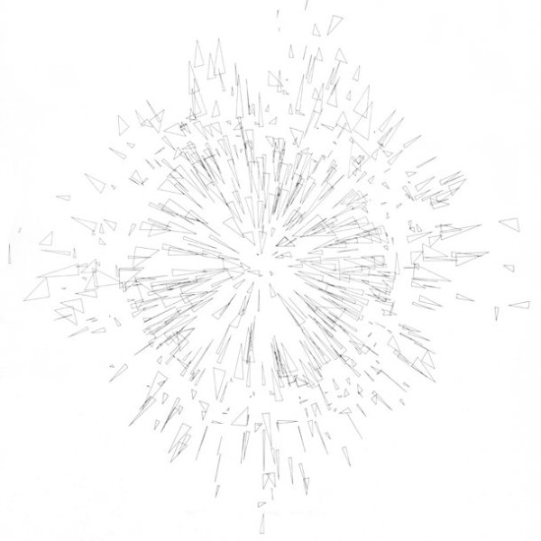

# The Soulless Usurper: Reception and Criticism of Early Computer Art
Grant Taylor

## Summary
The first article on computer art was "The Electronic Computer as an Artist" in 1964  by Rockman and Mezi. It included the first example of an award-winning piece of computer art genereated, not by a human artist, but rather by a team of technologists employed by the military (it was a visual representation of light distortions produced by a camera lens):

Of course, many in the orthodox art world were more than hostile to the computer not only as a creator, but as a tool. In the 60's and 70's, extreme resentment was aroused by computer art and included sabotage and physical attacks on the human artists. It was often reproached by critics for its percieved mechanical sterility.

Even in music, Joel Chadabe felt that critics and traditional musicians feared the computer and its "harmful influence" on music. From Elliot Schwartz:

`The notion of music "created" by a computer always seems to arouse a surprising degree of hostility, usually on the part of people who find twentieth-century art increasingly "dehumanized" and "mechanical".`

And from Jeanne Beaman (dance), in her introductory presentation to computer dance:

`Most of us do not even want a machine of any kind to succeed in conceiving any art form at all. The arts are usually presented as our last refuge from the onslaughts of our whole machine civilization with its attendant pressures towards squeezing us into the straitjacket of the organized man.`

In visual art, the response was most often the most hostile. In 1972, Robert Mueller wrote that computer art has been "exceedingly poor and uninspiring". Moreover, he stated that the technologists (who run the computer) lacked the necessary knowledge of art and its history, and although their work was mathemetically inspired, bored "the sophisticted mind to death." Others saw it as an example of the vulgarization of science, in which artists flirted with the latest scientific and technological media, producing was amounted to scientific kitsch.

### Unorthodox Beginning
As mentioned above, the origins of computer art were forged in the Cold War military industrial complex by a team of US Army ballistic scientists (winning first and second prizes in _Computers and Automation_'s competition). The call was for "any interesting and artistic drawing, design, or sketch made by a computer." (interestingly, it called for a sketch made _by_ a computer, not _on_ a computer, which of course begs the question, what is the maximum degree of human influence that can be tolerated while a work still being _by_ a computer? What does it mean for something to be _by_ a computer? That is, where the authorship can be attributed to the computer). Because of this early origin, the beginnings of computer art were often made to be after 1963 to avoid the uncomfortable truth in its beginning.

These works, though, were not made for aesthetic purposes. They were merely aesthetic by-products in more utilitarian pursuits.

## Reaction
It is not surprising that the reaction to early computer art was (and at times continues to be) hostile. It threatens the old guard and threatens to upend the way things are/have been done. This alone would be reason enough for the hostility. But the computer suggested something else: that the human could be rendered obsolete in the production of art and, maybe even more the case now, in the conception of an artwork.

__Mueller__. While I may not necessarily agree with Mueller in spirit, I think he's almost exactly right. At least at the time (maybe a bit before him), running a computer required a significant degree of technical sophistication on the part of the technician, thus leaving the art on the back-burner. Of course, there are numerous counterexamples but the few dozen counterexamples I can think of are, I imagine, a small sample of the total amount of computer art produced during that time. In the present, computers have become much more user friendly and allow artists to create work while not fighting with the machine to do their bidding.

__The Military Origins of Computer Art__ I think it's so strange that some folks wanted to avoid the fact that computer art had its beginning in the military and in fact, the military beat "artists" to the punch with creating worthy computer art (of course, the military had both the budget and technical knowledge to be able to pull it off whereas normal citizenry didn't have that infrastructure available). But avoiding it seems a bit silly, especially given the fact that one could argue that forms of visual art had their origin in the church
