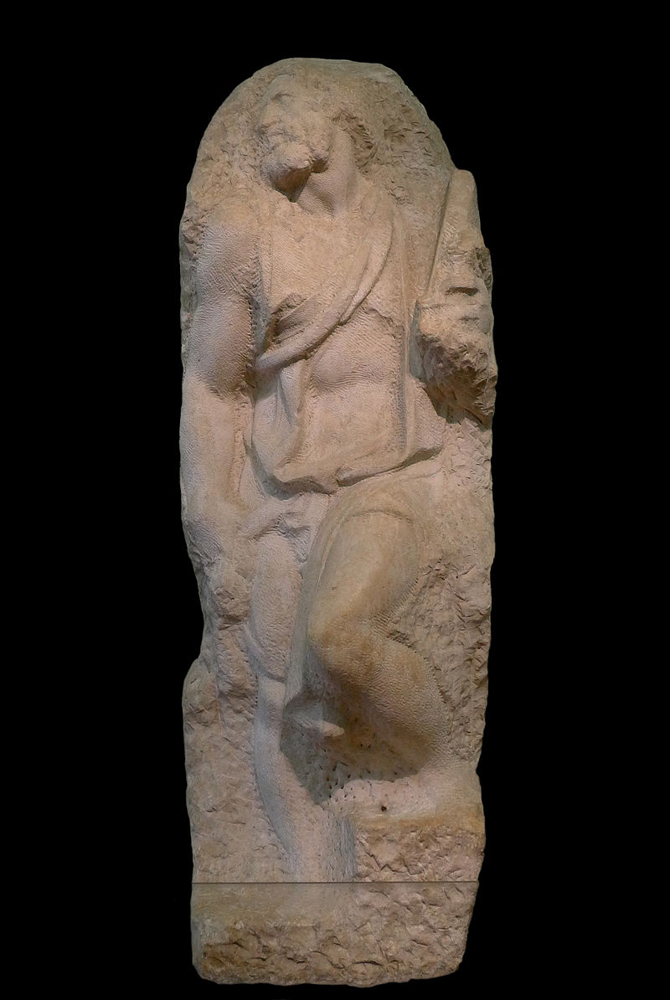
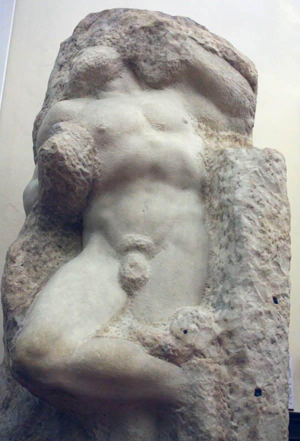
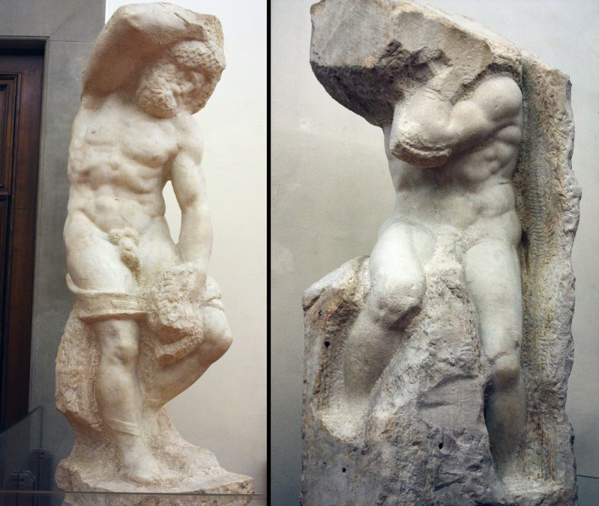

# Judgment and Purpose
Joel Fisher, 1987. excerpts from "Judgment and Purpose" in _The Success of Failure_

## Summary

Fisher begins by explaining how failure fits into our thinking (in the West, at least). The Greeks admired perfection but when the Christians came along, they didn't admonish the imperfect; instead, they accepted the weak, the sick, the imperfect as they were. With this in mind, Fisher proposes _anaprokopology_ (from the Greek _ano_, not, and _prokopi_, success) as a general term to designate the area of existence in which success is not achieved or is irrelevant.

Fisher goes on to discuss how we are often made to believe failure is more common than it is. He uses the example of a textbook on obstetrics he read before his son was born, describing all the ways the birth could go wrong but hardly mentioning the most likely outcome of a living, healthy child. However, manifest failure is relatively uncommon, as we can often anticipate failure from a distance and the path leading to it can then be abandoned. This leads Fisher to the idea of the "unfinished work".

As an example, Fisher uses Michaelango's unfinished sculptures. Although incomplete, they are generally considered masterpieces (`perhaps due to the fact that they're Michaelango's?`).

<d>

  <small>St. Matthew, 1506</small>   
</d>

<d>

  <small>The Awakening Slave, 1520-1523</small>  
</d>

<d>

  <small>The Bearded Slave, 1530-1534; The Atlas, 1530-1534</small>  
</d>

The unfinished is no longer viewed with negative prejudice or suspended judgment as they were in the past (`citation needed...`). If this is true, then it seems, Fisher suggests, that a work is "somehow complete at every point in its development."

Fisher goes on to suggest that many inevitable failures are abandoned only to be finished later (`Warhol's Empire comes to mind`). But then the question arises, "How can one expect to recognize failure at a time when one doesn't know or recognize one's goals?" The clarity of a work is evolutionary and that clarity sometimes does not ever appear. The artist is left with nagging suspicions and, in the case of Picasso's _Les Demoiselles d'Avignon_, kept rolled up under the bed, out of sight from both the artist and the world but [`interestingly`] not discarded. (`This makes me think of Cage's 4'33" which was completed many years before it was premiered. In that case, however, it was Rauchenberg's White Paintings that prompted Cage to premiere the work.`)

## Reaction

I might even venture to say that Michaelango's unfinished works are more beautiful (perhaps not as _impressive_, though), than his finished works.
This is of course related to my ramblings on Exposure. Here the illusion of form is broken, we see the medium for what it is and that adds new or different metaphorical dimensionality to the work. It can say something more about the content (I'm thinking specifically of the _Awakening Slave_. What a wonderful image!). So it seems my ramblings on exposure are not without precedent.

What would be really wonderful and, I imagine, provoke all sorts of questions, is to try to create a series of works that are "fake" pieces attributed to you (I take the Picasso example as a starting point). What would it mean, or take, to create a "fake" version of your own work, where authorship can be directly attributed to you? Is this possible? What does it mean for a work to be "fake"? I suppose one solution would be to outsource the labor; that is, go on Amazon Turk, send a worker a bunch of your pieces and ask them to create another piece using your ideas. Even if legally one could have all the rights to the piece, would I really be the author?
